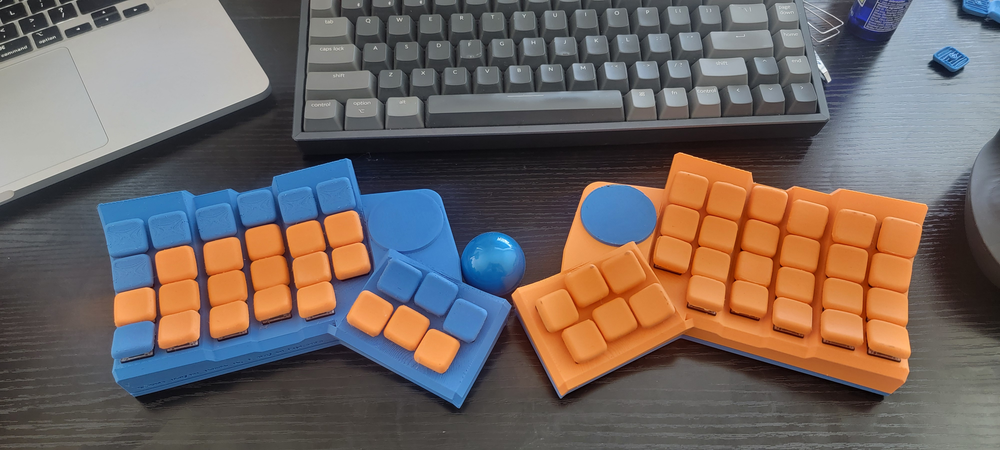
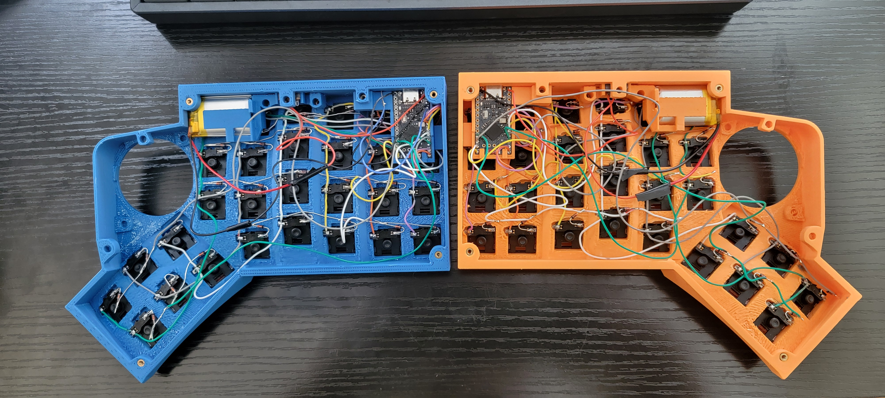
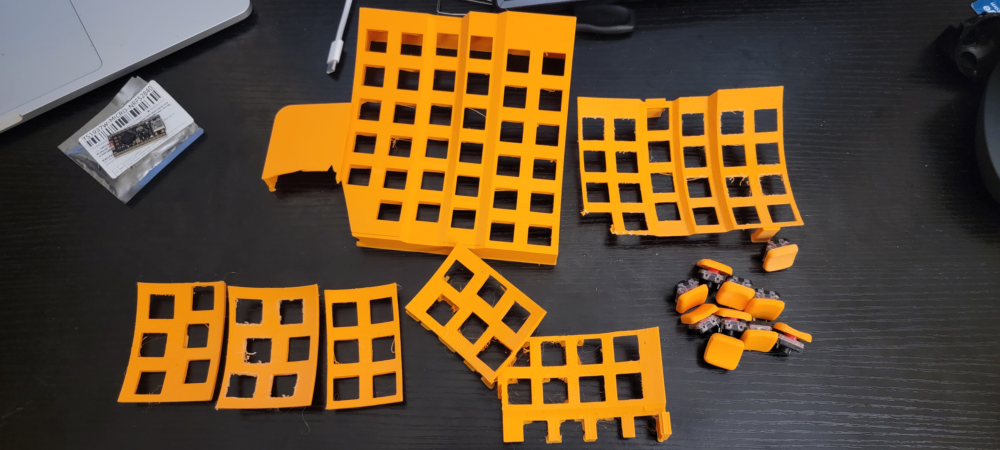
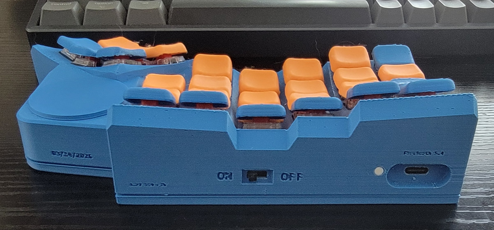

# DuymeFlex

Custom wireless split keyboard. Designed for medium and big hands. Keymap is optimized for C# coding. Trackball is in progress.

Firmware is **ZMK**.
Microcontroller is based on **nrf52840**, supermini nrf52840.

